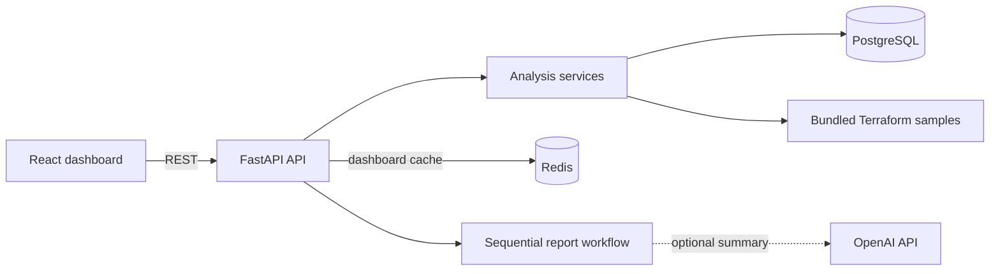

# AI CloudOps Platform

[](https://github.com/KevanMehta/ai-cloudops-platform/actions/workflows/ci.yml)
[](LICENSE)

A full-stack reference implementation for exploring cloud cost analysis, infrastructure checks, and operational reporting with deterministic demo data.

## Why I Built This

I built this project to understand how cost, infrastructure, and workload signals can be normalized behind one API and turned into an explainable operational report. The focus is the system boundary between data collection, rule-based analysis, optional language-model summarization, and a dashboard—not a live cloud-management product.

## Features

- Cost dashboard and service-level trends from 90 days of seeded AWS-like billing records
- Rolling-baseline anomaly detection with persisted explanations
- Rule-based checks for the bundled Terraform samples
- Health classification for eight seeded Kubernetes workload records
- Recommendation generation from cost, anomaly, Terraform, and workload data
- Five-step reporting workflow with an optional OpenAI-generated summary and deterministic fallback
- REST API, Swagger documentation, Prometheus metrics, and JSON logs
- Docker Compose environment for the frontend, API, PostgreSQL, and Redis

> [!NOTE]
> The repository does not connect to AWS or a Kubernetes cluster. Cost, workload, findings, and savings values shown in the UI come from deterministic demo inputs and heuristics.

## Architecture


```mermaid
flowchart LR
    Browser[React dashboard] -->|REST| API[FastAPI API]
    API --> Services[Analysis services]
    Services --> DB[(PostgreSQL)]
    API -->|dashboard cache| Redis[(Redis)]
    Services --> Samples[Bundled Terraform samples]
    API --> Workflow[Sequential report workflow]
    Workflow -. optional summary .-> OpenAI[OpenAI API]
```

FastAPI exposes synchronous endpoints and coordinates stateless analysis services. PostgreSQL stores seeded inputs and derived results. Redis caches only the dashboard response for five minutes; cache failures fall back to PostgreSQL. The React frontend consumes the API through a small typed client.

The reporting workflow runs cost analysis, anomaly detection, infrastructure inspection, recommendation generation, and summary generation in order. It is implemented locally in Python and does not use the LangGraph package.

## Engineering Decisions

- **FastAPI and Pydantic:** keep request validation, response schemas, and generated API documentation close to the Python analysis code. A Java service would provide stronger compile-time constraints but add ceremony to this portfolio-sized system.
- **PostgreSQL:** stores relational cost records and derived findings with indexed date and service fields. SQLite would simplify startup, but would not demonstrate the same service boundary used by the Docker environment.
- **Redis:** caches the read-heavy dashboard aggregate with a five-minute TTL. The cache is deliberately nonessential; reads and writes fail open so a Redis outage does not prevent database-backed responses.
- **Rule-based analysis:** makes anomaly thresholds and infrastructure findings inspectable and repeatable. A learned detector could capture more complex patterns, but would require representative training and evaluation data that this repository does not have.
- **Optional OpenAI summary:** limits model use to rewriting already-derived facts. When the key is absent or the request fails, the workflow returns a deterministic template.
- **Docker Compose:** provides a reproducible local topology without claiming a deployment architecture. It is simpler than Kubernetes for the repository's local demonstration scope.

See [docs/decisions.md](docs/decisions.md) for the decision records and consequences.

## Quick Start

### Prerequisites

- Docker with Docker Compose
- An OpenAI API key only if you want model-generated report summaries

```bash
git clone https://github.com/KevanMehta/ai-cloudops-platform.git
cd ai-cloudops-platform
cp .env.example .env
docker compose up --build
```

The database is initialized and demo data is seeded on first startup.

| Service | URL |
| --- | --- |
| Dashboard | <http://localhost:3000> |
| API | <http://localhost:8000> |
| Swagger UI | <http://localhost:8000/docs> |
| Health check | <http://localhost:8000/health> |
| Prometheus metrics | <http://localhost:8000/metrics> |

To enable the optional summary integration, set `OPENAI_API_KEY` in `.env` and restart the backend. The configured model is `gpt-4o-mini`.

## API

| Method | Endpoint | Purpose |
| --- | --- | --- |
| `GET` | `/health` | Report API, PostgreSQL, and Redis status |
| `GET` | `/metrics` | Expose Prometheus-format process and API metrics |
| `GET` | `/api/dashboard` | Return cached dashboard aggregates |
| `GET` | `/api/costs?days=90` | Query seeded cost records |
| `GET` | `/api/anomalies` | List persisted anomaly results |
| `GET` | `/api/recommendations` | List heuristic recommendations |
| `GET` | `/api/kubernetes` | Summarize seeded workload records |
| `POST` | `/api/terraform/analyze` | Analyze bundled Terraform files |
| `POST` | `/api/agent/run` | Run the sequential reporting workflow |

## Testing

The backend suite contains unit tests for anomaly classification, anomaly persistence and deduplication, and recommendation generation. The frontend suite renders `StatCard` and checks its displayed values and optional subtitle. There are currently no PostgreSQL integration, API contract, browser end-to-end, workload-health, Terraform-analyzer, or live-cloud tests.

```bash
# Backend
cd backend
python -m pip install -r requirements.txt
pytest -v

# Frontend (from the repository root)
cd frontend
npm ci
npm test -- --run
```

GitHub Actions runs both suites, audits frontend dependencies at high severity, and verifies the frontend build on pushes and pull requests targeting `main` or `master`. The backend CI job provisions PostgreSQL and Redis services, although the current unit tests do not exercise them.

## Project Structure

```text
backend/app/        FastAPI entry point, schemas, persistence, analysis, and seed logic
backend/tests/      Backend unit tests
frontend/src/       React pages, shared components, API client, and types
frontend/src/test/  Frontend component tests
infra-samples/      Deliberately imperfect Terraform fixtures used by the analyzer
docs/               Architecture decision records
.github/             CI, dependency updates, and contribution templates
```

## Tradeoffs

- The project uses seeded, single-account data; it has no cloud credentials, collectors, or refresh jobs.
- Terraform files are scanned with regular expressions, not parsed into a complete HCL syntax tree. Findings are educational heuristics and can miss or misclassify valid configurations.
- Kubernetes health is calculated from stored demo rows, not the Kubernetes API or a metrics system.
- Savings amounts are fixed or formula-based estimates over demo values. They are not benchmarks, billing forecasts, or validated savings.
- The API has no authentication or authorization, CORS allows every origin, and the local default database password is public. The environment is intended for local evaluation only.
- Schema creation uses SQLAlchemy metadata during seeding; Alembic is installed but no migrations are included.
- The reporting workflow executes synchronously in the API process and has no queue, retries, cancellation, or durable step orchestration.

## Future Improvements

- Replace regex Terraform checks with an HCL parser and fixture-based analyzer tests
- Add repository-level API and PostgreSQL integration tests
- Add authentication, restricted CORS, secret management, and database migrations before any shared deployment
- Define provider interfaces for AWS Cost Explorer and Kubernetes metrics while keeping demo adapters for local use
- Calibrate recommendation estimates against documented inputs or remove monetary estimates
- Move long-running report execution to a background worker with explicit run state

## Contributing

See [CONTRIBUTING.md](CONTRIBUTING.md) for setup, test, and pull request expectations. Security reports should follow [SECURITY.md](SECURITY.md).

## License

This project is licensed under the [MIT License](LICENSE).
