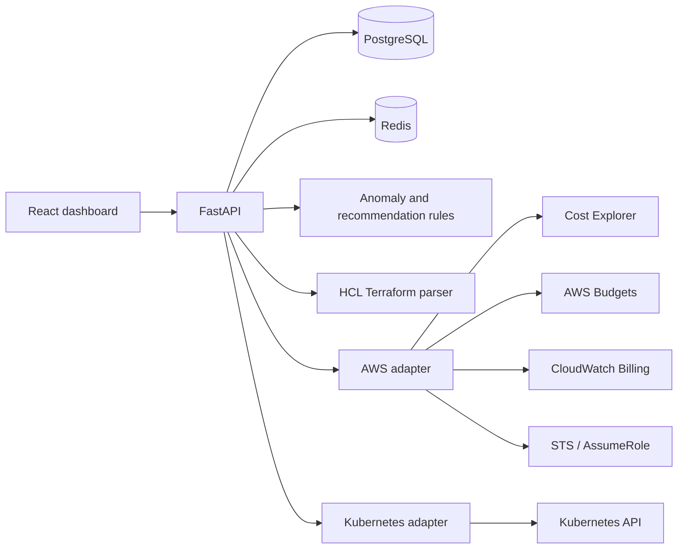

# AI CloudOps Platform

[](https://github.com/KevanMehta/ai-cloudops-platform/actions/workflows/ci.yml)
[](LICENSE)

A CloudOps reference implementation that imports AWS billing data, inventories Kubernetes workloads, analyzes Terraform, and produces rule-based operational recommendations.

## Why I Built This

I built this project to explore the boundary between cloud-provider APIs, normalized operational data, deterministic analysis, and a reviewable dashboard. It supports real provider connections without making them a prerequisite for evaluating the system locally.

## Operating Modes

| Mode | External calls | Startup data | Intended use |
| --- | --- | --- | --- |
| `demo` | None | Deterministic AWS-like costs, Kubernetes workloads, and Terraform findings | Local evaluation |
| `connected` | Operator-triggered AWS and Kubernetes syncs | Empty database schema | Read-only provider inventory |
| `offline` | None | Empty database schema; existing records remain available | Disconnected analysis of previously stored data |

Set `OPERATING_MODE` before startup. Connected mode does not poll providers automatically and never falls back to demo data.

## Implemented Capabilities

- AWS Cost Explorer daily `UnblendedCost` ingestion grouped by service and region
- Standard AWS credential-chain support with optional STS `AssumeRole` and external ID
- AWS Budgets summary and CloudWatch `AWS/Billing` estimated-charge snapshot
- Kubernetes Deployment and StatefulSet inventory using in-cluster or kubeconfig authentication
- Pod restart aggregation and readiness-based health classification
- Terraform parsing through `python-hcl2` with checks for public S3 ACLs, fixed capacity, review-worthy instance sizes, and missing cost-allocation tags
- Rolling-baseline cost anomaly detection and evidence-based recommendations
- Optional OpenAI summary of already-derived facts; deterministic summaries remain the default
- PostgreSQL persistence, Redis dashboard caching, Prometheus metrics, JSON logs, request IDs, and restricted CORS

Savings fields remain present for API compatibility but return zero unless a future implementation can support an estimate with measured utilization and pricing inputs.

## Architecture


```mermaid
flowchart LR
    UI[React dashboard] --> API[FastAPI]
    API --> DB[(PostgreSQL)]
    API --> Cache[(Redis)]
    API --> Rules[Anomaly and recommendation rules]
    API --> HCL[HCL Terraform parser]
    API --> AWS[AWS adapter]
    API --> K8S[Kubernetes adapter]
    AWS --> CE[Cost Explorer]
    AWS --> Budgets[AWS Budgets]
    AWS --> CW[CloudWatch Billing]
    AWS --> STS[STS / AssumeRole]
    K8S --> Cluster[Kubernetes API]
```

Provider synchronization is an explicit API operation. Each adapter completes remote reads before replacing its stored snapshot. A provider failure therefore does not delete the last successful dataset. Budgets and CloudWatch billing are optional enrichments: missing permissions produce response warnings but do not discard successfully fetched Cost Explorer records.

## Architecture Decisions

- **Explicit modes:** prevent a failed provider connection from silently showing simulated data.
- **Operator-triggered synchronization:** keeps provider access visible and avoids embedding an undeclared scheduler in the API process.
- **AWS default credential chain:** supports environment credentials, shared profiles, container credentials, and instance roles without storing access keys in the application.
- **Optional AssumeRole:** supports cross-account reads while keeping the source credential outside the database.
- **PostgreSQL snapshots:** give analysis services one normalized model regardless of provider source.
- **Redis as a nonessential cache:** dashboard reads fall back to PostgreSQL and synchronization invalidates the relevant cache key.
- **HCL parser instead of regex:** handles Terraform syntax structurally, while deliberately stopping short of plan evaluation or policy-as-code claims.
- **Deterministic recommendations:** findings remain inspectable; the language model is limited to optional report wording.

Detailed records are in [docs/decisions.md](docs/decisions.md).

## Quick Start: Demo Mode

Requirements: Docker and Docker Compose.

```bash
git clone https://github.com/KevanMehta/ai-cloudops-platform.git
cd ai-cloudops-platform
cp .env.example .env
docker compose up --build
```

| Service | URL |
| --- | --- |
| Dashboard | <http://localhost:3000> |
| API and OpenAPI UI | <http://localhost:8000/docs> |
| Health | <http://localhost:8000/health> |
| Prometheus metrics | <http://localhost:8000/metrics> |

## Connected AWS Mode

Use short-lived credentials through the AWS SDK credential chain. Do not add access keys to `.env`.

```env
OPERATING_MODE=connected
AWS_REGION=us-east-1
AWS_ROLE_ARN=arn:aws:iam::111122223333:role/CloudOpsReadOnly
AWS_EXTERNAL_ID=optional-shared-value
AWS_COST_LOOKBACK_DAYS=90
```

When using Docker Compose, place an AWS config and credentials directory at `.local/aws/` or set `AWS_CONFIG_DIR` to a different host directory. Set `AWS_PROFILE` when needed. Workload roles are preferable in a hosted container environment.

Minimum permissions depend on the enabled reads:

```json
{
  "Version": "2012-10-17",
  "Statement": [
    {
      "Effect": "Allow",
      "Action": [
        "ce:GetCostAndUsage",
        "budgets:ViewBudget",
        "cloudwatch:GetMetricData",
        "sts:GetCallerIdentity"
      ],
      "Resource": "*"
    }
  ]
}
```

If `AWS_ROLE_ARN` is set, the source identity also needs `sts:AssumeRole` on that role and the target role trust policy must allow it.

Trigger a read-only import:

```bash
curl -X POST http://localhost:8000/api/integrations/aws/sync
```

Cost Explorer data may be delayed by AWS. Budgets access is generally associated with the payer or management account. CloudWatch billing metrics are available only when AWS billing alerts expose `AWS/Billing` metrics in `us-east-1`.

## Connected Kubernetes Mode

The adapter tries in-cluster configuration first and then kubeconfig. With Docker Compose, place a config at `.local/kube/config` or set `KUBECONFIG_PATH`; optionally set `KUBERNETES_CONTEXT`.

Required RBAC is read-only access to Deployments, StatefulSets, and Pods across the namespaces you intend to inventory.

```bash
curl -X POST http://localhost:8000/api/integrations/kubernetes/sync
```

The current adapter records desired and ready replicas plus container restart counts. It does not query `metrics.k8s.io`; CPU and memory values are returned as unavailable for connected snapshots rather than estimated.

## API

| Method | Endpoint | Purpose |
| --- | --- | --- |
| `GET` | `/health` | Database, Redis, version, and operating mode |
| `GET` | `/metrics` | Prometheus-format application and request metrics |
| `GET` | `/api/dashboard` | Cached dashboard aggregates |
| `GET` | `/api/costs?days=90` | Stored cost records |
| `GET` | `/api/anomalies` | Persisted anomaly results |
| `GET` | `/api/recommendations` | Rule-based recommendations |
| `GET` | `/api/kubernetes` | Stored workload snapshot |
| `GET` | `/api/integrations/{provider}/status` | Configuration status without contacting the provider |
| `POST` | `/api/integrations/aws/sync` | Import AWS cost and billing data |
| `POST` | `/api/integrations/kubernetes/sync` | Import Kubernetes workload state |
| `POST` | `/api/terraform/analyze` | Analyze bundled Terraform files |
| `POST` | `/api/agent/run` | Run the sequential analysis and reporting workflow |

## Observability

- JSON logs include timestamp, logger, level, message, and request ID.
- Incoming `X-Request-ID` values are preserved; otherwise the API creates one and returns it in the response.
- `cloudops_http_requests_total` and `cloudops_http_request_duration_seconds` are labeled by HTTP method and route template to avoid unbounded path labels.
- `cloudops_provider_sync_total` records successful and failed AWS and Kubernetes sync attempts.
- Redis errors are logged and treated as cache misses; provider syncs invalidate the dashboard cache.

## Testing

```bash
cd backend
python -m pip install -r requirements.txt
pytest -v

cd ../frontend
npm ci
npm test -- --run
npm audit --audit-level=high
npm run build
```

The backend suite covers rule behavior, SQLite-backed API integration, AWS mapping and transactional ingestion with mocked SDK boundaries, credential failure, Kubernetes snapshot import, HCL parsing, malformed Terraform, and path traversal. It does not contact AWS or Kubernetes during tests. CI provisions PostgreSQL and Redis, though the API integration tests currently use SQLite and mocked Redis health.

## Deployment

Docker Compose is the supported local topology. It runs the API as a non-root user and restricts CORS to configured origins. It is not a public-cloud deployment template.

Before a shared deployment, add authentication and authorization, TLS termination, secret delivery through the hosting platform, database migrations and backups, request rate limits, network policies, a background sync scheduler or worker, and a provider-permission review. Do not expose the sync endpoints publicly without those controls.

## Tradeoffs

- Cost data is replaced for the configured account and lookback window; there is no immutable ingestion ledger.
- Cost Explorer grouping is limited to service and region and uses unblended cost only.
- Budgets and CloudWatch billing results are returned with a sync response but are not persisted historically.
- Kubernetes inventory does not evaluate Services, Jobs, DaemonSets, events, resource requests, or Metrics Server utilization.
- Terraform parsing does not evaluate modules, variables, provider defaults, plans, or remote state. Findings are review prompts, not compliance results.
- The API has no authentication or authorization and executes synchronization in the request process.
- Database tables are created from SQLAlchemy metadata; Alembic is installed but migrations are not yet defined.
- The OpenAI integration sends the assembled summary to an external API when explicitly configured.

## Known Limitations

This project has not been validated against large payer accounts, multi-cluster fleets, AWS Organizations, or production traffic. It has no benchmark suite, no availability objective, and no claimed deployment scale.

## Project Structure

```text
backend/app/integrations/  AWS and Kubernetes provider adapters
backend/app/services/      Deterministic analysis, caching, and Terraform logic
backend/app/routers/       HTTP endpoints and provider sync orchestration
backend/tests/             Unit, mocked provider, and API integration tests
frontend/src/              React dashboard and API client
infra-samples/             Deliberately imperfect Terraform fixtures
docs/                      Architecture decisions and release notes
```

## Security

See [SECURITY.md](SECURITY.md) for the supported version policy, reporting process, credential assumptions, and known security gaps.

## Contributing

See [CONTRIBUTING.md](CONTRIBUTING.md) for setup and verification expectations.

## License

This project is licensed under the [MIT License](LICENSE).
